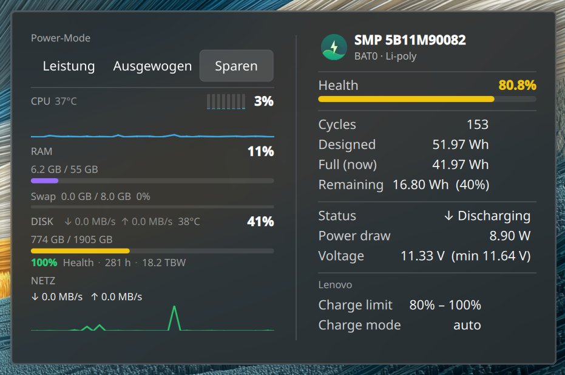

# HealthPanel

A KDE Plasma 6 widget that puts your machine's vital signs in one place: a live
left column — power profile, CPU, RAM, disk, network, temperatures and SSD SMART —
beside a detailed battery panel, in a single tidy popup.

> Developed and tested on Wayland with Plasma 6 (Qt 6.11); designed to run on any
> Linux laptop or desktop running Plasma 6.



## Features

**System column (left)** — each section can be hidden, each metric has a
selectable display style (bar · ring · sparkline):

- **Power profile** — Leistung / Ausgewogen / Sparen, **click to switch live**
  (via `power-profiles-daemon` or `tuned-ppd`; no root, no password prompt)
- **CPU** — total load + per-physical-core mini-bars + temperature
- **RAM + Swap** — usage in % and GB
- **Disk** — root-filesystem usage, read/write throughput, temperature
- **Network** — down/up throughput (text or sparkline)
- **SSD SMART** — health, power-on hours, terabytes written (NVMe and SATA)

**Battery column (right)** — sections individually toggleable:

- Health (with colour-coded bar), cycle count, designed/full/remaining capacity,
  live status + estimated time, power draw, voltage, serial
- Lenovo/vendor charge thresholds when the kernel exposes them

Everything refreshes on a configurable interval (1–30 s).

## Requirements

- **KDE Plasma 6** (Qt 6)
- For **SSD SMART**: `smartmontools` (`smartctl`) and `jq` — read by a small
  root-side timer (see below). Without them the SMART line just stays hidden.
- For **live power-profile switching**: `power-profiles-daemon` or `tuned-ppd`
  (most modern distros ship one). Without it the switch is hidden.

CPU/RAM/disk/network/temperatures need nothing extra — they come from `/proc`
and `/sys` (`hwmon`).

## Install

```bash
git clone https://github.com/sunsetterphoto/HealthPanel.git
cd HealthPanel
./install.sh        # NOT with sudo — it calls sudo itself only for the SMART timer
```

Then add the widget: right-click the desktop or panel → *Add Widgets…* →
**HealthPanel**.

`install.sh` installs the Plasma widget, the optional `battinfo` battery CLI, and
sets up the root SMART timer. To remove everything: `./uninstall.sh`.

> **Reload note:** Plasma caches widget QML in memory. After an upgrade
> (`git pull && ./install.sh`), restart the shell to pick up changes:
> `systemctl --user restart plasma-plasmashell.service`.

### SSD SMART (root timer)

SMART data needs root, so the widget never reads the disk directly. A tiny
script (`healthpanel-smart`) runs hourly via a **systemd system timer**, writes
`{healthPct, powerOnHours, tbwTB}` to `/var/lib/healthpanel/smart.json`
(world-readable), and the widget only reads that file. `install.sh` sets this up
(asks for sudo once). On SELinux systems the units are copied into `/etc` and
re-labelled with `restorecon` (a home-symlinked system unit would be rejected).

## Configuration

Right-click the widget → *Configure HealthPanel* → *General*:

- **Refresh interval** (1–30 s)
- **System column shows:** per-section checkboxes
- **Display style** per metric: **Balken** (bar), **Ring** (donut), **Sparkline**
  (history graph); network: Text or Sparkline
- **Battery column shows:** per-section checkboxes

## Optional CLI: `battinfo`

A self-contained Bash tool for detailed battery info in the terminal, plus a
`--user` systemd timer that logs one health snapshot per day to
`~/.local/state/battinfo/history.tsv`.

```bash
battinfo            # one-shot report
battinfo -w         # live watch
battinfo --history  # show logged history
```

## How it reads your hardware

HealthPanel doesn't scan for arbitrary sensors — it reads from fixed, well-defined
sources:

- **CPU / RAM / disk / network** come straight from the kernel: `/proc/stat`,
  `/proc/meminfo`, `df` on `/`, `/proc/diskstats` and `/proc/net/dev`. These are
  universal and unambiguous.
- **Temperatures** are matched **by sensor name** in `hwmon`, not picked at
  random: the CPU temperature only from `k10temp` / `coretemp` / `zenpower` /
  `cpu_thermal` / `soc_thermal`, the disk temperature only from `nvme`. An
  unrelated chip's sensor is never shown as the CPU or disk temperature.
- The **battery** is the first `/sys/class/power_supply` device of type
  *Battery*; the **disk** for SMART is the whole disk backing `/`.

If an expected source isn't present, the field is simply **hidden — never
guessed**.

## Hardware notes

HealthPanel was developed and tested on a **Lenovo ThinkPad Z13 Gen 2**; what you
actually see depends on what your hardware and firmware expose. Two sensors happen
to be unreachable from Linux *on the Z13 Gen 2 specifically* — **your laptop may
well expose them:**

- **RAM temperature** — on the Z13 Gen 2 the embedded controller holds the DDR5
  SPD i2c bus exclusively, so the `spd5118` driver can't bind. Many other boards
  do expose a DIMM/SPD temperature, and HealthPanel will show it when present.
- **Battery temperature** — the kernel `power_supply` interface and `upower`
  don't report it on this model. Plenty of laptops do. HealthPanel never displays
  a guessed value: if the sensor isn't there, the field simply doesn't appear.

## Architecture

- All parsing/maths lives in pure JS (`plasmoid/contents/ui/sysparse.js`), shared
  by QML and Node — unit-tested with `node --test tests/sysparse.test.js`.
- `SystemData.qml` feeds probe output through `sysparse.parseProbe()`;
  `SystemColumn.qml` renders the left column, `BatteryCard.qml` the right,
  `MonitorView.qml` combines them as the full representation.
- One probe per refresh takes two `/proc` snapshots 0.5 s apart in a single
  `sh -c` call, so rates are self-contained (no cross-tick state).

## License

[GPL-3.0](LICENSE) · © snieds ([@sunsetterphoto](https://github.com/sunsetterphoto))
