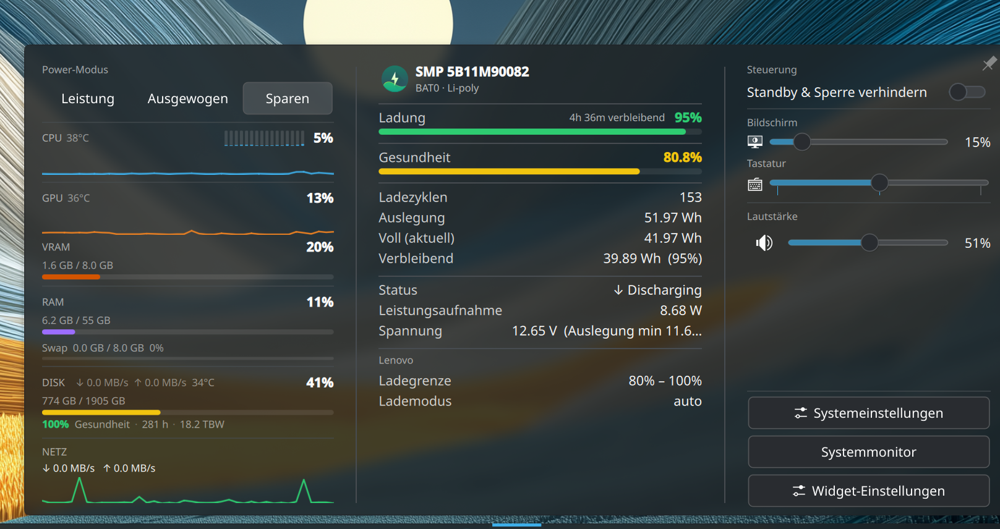
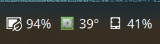
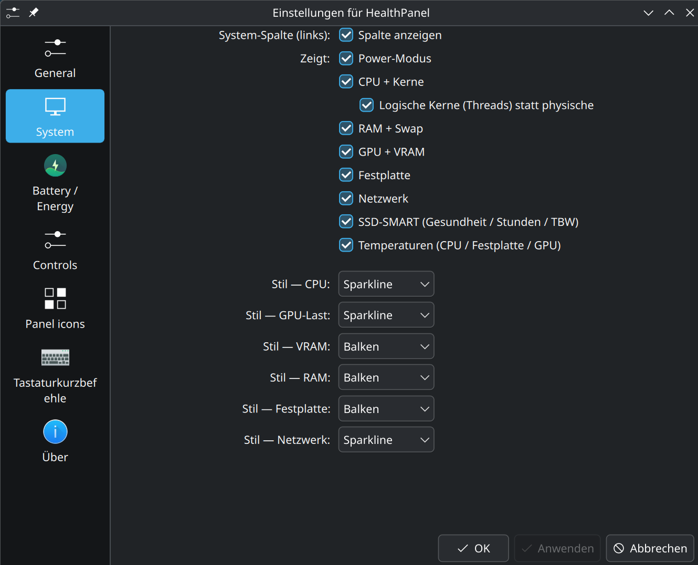
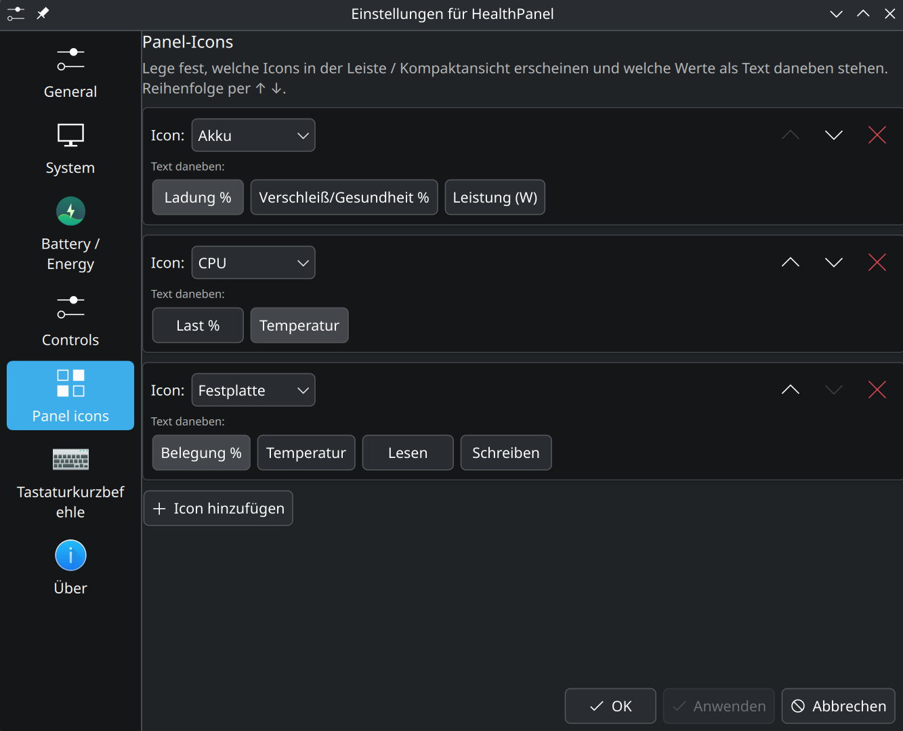

# HealthPanel

A KDE Plasma 6 widget that puts your machine's vital signs **and** quick controls
in one place: a live system column, a detailed battery panel, and a quick-controls
column — in a single tidy popup, with a configurable panel/compact view.

> Developed and tested on Wayland with Plasma 6 (Qt 6.11); designed to run on any
> Linux laptop or desktop running Plasma 6.



The three columns are independent — each can be hidden, the popup resizes to fit
what's shown, and it can be **pinned** to stay open.

## Features

### System column — live load

Each section can be hidden; each metric has a selectable display style
(**bar · ring · sparkline**):

- **Power profile** — Performance / Balanced / Power Saver, **click to switch live**
  (via `power-profiles-daemon` or `tuned-ppd`; no root, no password prompt)
- **CPU** — total load + per-core mini-bars (physical cores or logical threads) +
  temperature
- **GPU + VRAM** — load, VRAM usage and temperature (AMD `amdgpu`, when present)
- **RAM + Swap** — usage in % and GB
- **Disk** — root-filesystem usage, read/write throughput, temperature
- **Network** — down/up throughput (text or sparkline)
- **SSD SMART** — health, power-on hours, terabytes written (NVMe and SATA)

### Battery column — detailed health

Sections individually toggleable:

- **Prominent remaining-charge bar** with estimated time to full / time left —
  the dominant info, right at the top
- **Health** bar, cycle count, designed / full / remaining capacity
- Live status, power draw, voltage, serial number
- Lenovo/vendor charge thresholds when the kernel exposes them

### Controls column — quick settings

Each row is toggleable and only appears when its backend is actually available —
all **root-free**, via the standard KDE / PipeWire D-Bus services:

- **Prevent standby & lock** while you need the machine awake (`systemd-inhibit`)
- **Screen brightness** slider
- **Keyboard backlight** slider
- **Volume + mute**
- Quick jump-offs: **System Settings**, **System Monitor**, **Widget Settings**

### Panel / compact view

In the panel the widget shows a configurable row of icons — any of
battery / CPU / RAM / disk / network — each with optional value text beside it.
The battery icon also encodes the active power profile, KDE-style (leaf =
power-saver, rocket = performance).



Everything refreshes on a configurable interval (1–30 s). The UI language follows
the **System default** or can be forced to **German** or **English**.

## Requirements

- **KDE Plasma 6** (Qt 6)
- For **SSD SMART**: `smartmontools` (`smartctl`) and `jq` — read by a small
  root-side timer (see below). Without them the SMART line just stays hidden.
- For **live power-profile switching**: `power-profiles-daemon` or `tuned-ppd`
  (most modern distros ship one). Without it the switch is hidden.

CPU / RAM / disk / network / temperatures / GPU need nothing extra — they come
from `/proc` and `/sys` (`hwmon`, `drm`). The control sliders use the screen,
keyboard and audio services already present on a normal Plasma desktop.

## Install

```bash
git clone https://github.com/sunsetterphoto/HealthPanel.git
cd HealthPanel
./install.sh        # NOT with sudo — it calls sudo itself only for the SMART timer
```

Then add the widget: right-click the desktop or panel → *Add Widgets…* →
**HealthPanel**.

`install.sh` installs the Plasma widget, the `healthpanel` CLI, and sets up the
root SMART timer. To remove everything: `./uninstall.sh`.

> **Reload note:** Plasma caches widget QML in memory. After an upgrade
> (`git pull && ./install.sh`), restart the shell to pick up changes:
> `systemctl --user restart plasma-plasmashell.service`.

### SSD SMART (root timer)

SMART data needs root, so the widget never reads the disk directly. A tiny
script (`healthpanel-smart`) runs hourly via a **systemd system timer**, writes
`{healthPct, powerOnHours, tbwTB}` to `/var/lib/healthpanel/smart.json`
(world-readable), and the widget only reads that file. `install.sh` sets this up
(asks for sudo once). On SELinux systems the units are copied into `/etc` and
re-labelled with `restorecon` (a home-symlinked system unit would be rejected).

## Configuration

Right-click the widget → *Configure HealthPanel*. The settings are split into one
page per column, plus the panel layout:

- **General** — refresh interval and UI language (System / Deutsch / English)
- **System** — which sections show, physical vs. logical cores, and the display
  style per metric (bar · ring · sparkline; network: text · sparkline)
- **Battery / Energy** — which battery detail blocks show
- **Controls** — which quick-settings rows show
- **Panel icons** — the icons in the panel/compact view and their value texts





## CLI: `healthpanel`

A self-contained Bash companion that prints the same data in the terminal —
system **and** battery, in detail. A `--user` systemd timer also logs one battery
health snapshot per day to `~/.local/state/healthpanel/history.tsv`.

```bash
healthpanel            # full report: system + battery
healthpanel system     # CPU / GPU / RAM / disk / network / power profile only
healthpanel battery    # battery section only
healthpanel temps      # all hwmon temperature sensors
healthpanel -w         # live watch (combinable, e.g. `healthpanel -w system`)
healthpanel --history  # logged battery history
```

## How it reads your hardware

HealthPanel doesn't scan for arbitrary sensors — it reads from fixed, well-defined
sources:

- **CPU / RAM / disk / network** come straight from the kernel: `/proc/stat`,
  `/proc/meminfo`, `df` on `/`, `/proc/diskstats` and `/proc/net/dev`. These are
  universal and unambiguous.
- **GPU** comes from `drm`/`sysfs` (`gpu_busy_percent`, `mem_info_vram_*`) with
  its temperature from the matching `amdgpu` `hwmon`.
- **Temperatures** are matched **by sensor name** in `hwmon`, not picked at
  random: the CPU temperature only from `k10temp` / `coretemp` / `zenpower` /
  `cpu_thermal` / `soc_thermal`, the disk temperature only from `nvme`. An
  unrelated chip's sensor is never shown as the CPU or disk temperature.
- The **battery** is the first `/sys/class/power_supply` device of type
  *Battery*; the **disk** for SMART is the whole disk backing `/`.

If an expected source isn't present, the field is simply **hidden — never
guessed**.

## Hardware notes

HealthPanel was developed and tested on a **Lenovo ThinkPad Z13 Gen 2**; what you
actually see depends on what your hardware and firmware expose. Two sensors happen
to be unreachable from Linux *on the Z13 Gen 2 specifically* — **your laptop may
well expose them:**

- **RAM temperature** — on the Z13 Gen 2 the embedded controller holds the DDR5
  SPD i2c bus exclusively, so the `spd5118` driver can't bind. Many other boards
  do expose a DIMM/SPD temperature, and HealthPanel will show it when present.
- **Battery temperature** — the kernel `power_supply` interface and `upower`
  don't report it on this model. Plenty of laptops do. HealthPanel never displays
  a guessed value: if the sensor isn't there, the field simply doesn't appear.

## Architecture

- All parsing/maths lives in pure JS (`plasmoid/contents/ui/sysparse.js`), shared
  by QML and Node — unit-tested with `node --test tests/sysparse.test.js`.
- `SystemData.qml`, `BatteryData.qml` and `ControlData.qml` feed probe output
  into the UI; `SystemColumn.qml`, `BatteryCard.qml` and `ControlColumn.qml`
  render the three columns, and `MonitorView.qml` combines them as the full
  representation. `Compact.qml` draws the configurable panel view.
- Backends are root-free D-Bus / CLI calls: power profile via `power-profiles-daemon`/
  `tuned-ppd`, brightness via `org.kde.ScreenBrightness` and `UPower`, volume via
  `wpctl`, wake-lock via `systemd-inhibit`.
- One probe per refresh takes two `/proc` snapshots 0.5 s apart in a single
  `sh -c` call, so rates are self-contained (no cross-tick state).
- In-widget translations live in `plasmoid/contents/ui/i18n.js` (English source
  strings, German dictionary) so the language switch is independent of the locale.

## License

[GPL-3.0](LICENSE) · © snieds ([@sunsetterphoto](https://github.com/sunsetterphoto))
